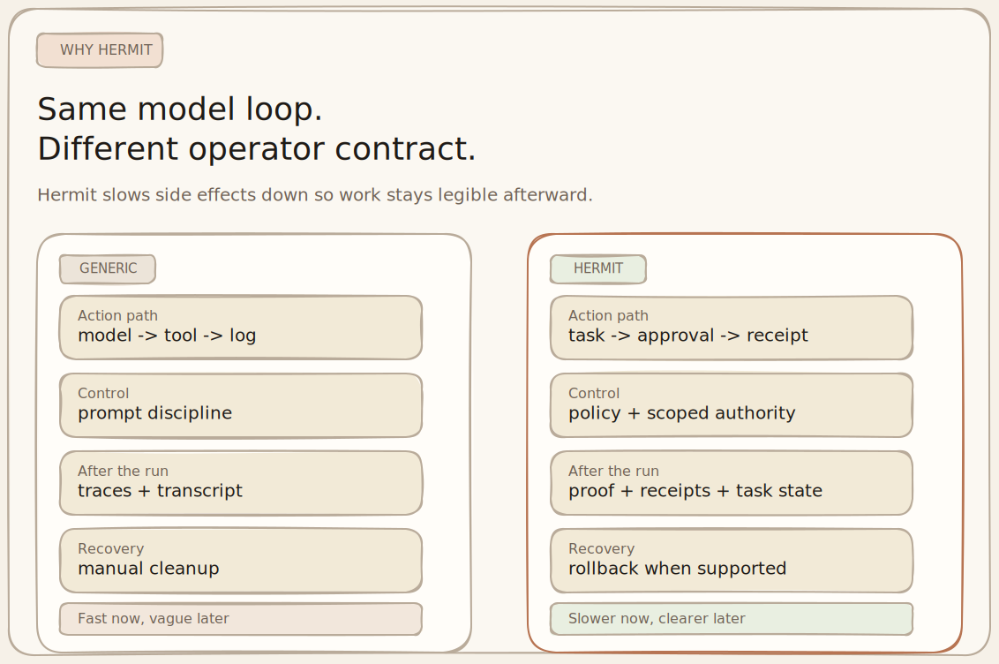
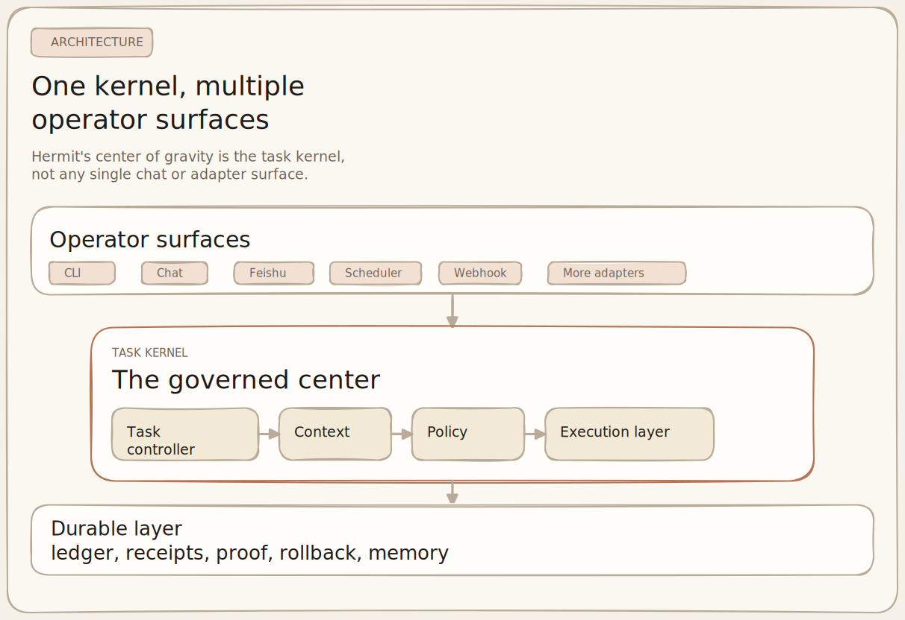

# Hermit

<p align="center">
  <picture>
    <source media="(prefers-color-scheme: dark)" srcset="./docs/assets/hermit-icon-white.svg">
    <source media="(prefers-color-scheme: light)" srcset="./docs/assets/hermit-macos-icon.svg">
    
  </picture>
</p>

[English](./README.md) | [简体中文](./README.zh-CN.md)

[](https://github.com/heggria/Hermit/actions/workflows/ci.yml)
[](https://www.python.org/)
[](./LICENSE)
[](https://heggria.github.io/Hermit/)
[](https://pypi.org/project/hermit-agent/)
[](https://pypi.org/project/hermit-agent/)
[](https://discord.gg/XCYqF3SN)
[](https://github.com/heggria/Hermit/discussions)

> **Hermit is a local-first governed agent kernel for durable, inspectable AI work.**
>
> Same model loop. Different operator contract: approve before side effects, inspect receipts after execution, and roll back supported actions when needed.

Hermit is for people who want agent work to remain visible after the model stops talking.

It gives you:

- approvals before consequential actions
- durable task, step, and ledger state under `~/.hermit`
- receipts, proof summaries, and proof export after execution
- rollback-aware recovery for supported governed receipt classes
- plugin-driven ingress and automation surfaces for CLI, adapters, scheduler, webhook, MCP, and tools

Docs site: [heggria.github.io/Hermit](https://heggria.github.io/Hermit/)

## Same Model Loop, Different Operator Contract



Most agent tools optimize for “felt useful in the moment.” Hermit optimizes for “still inspectable afterward.”

That means the runtime is centered on durable task records, governed execution, and operator review instead of only transient chat output.

## What Hermit Actually Ships Today

Hermit is already a real beta codebase, not just a design doc.

Current shipped areas include:

- task ledger and core records
- governed execution with policy, approvals, and scoped authority
- receipts, proof summaries, and proof export
- reconciliation and contract-sensitive retries
- rollback with scoped coverage
- local-first CLI workflows
- Feishu, Slack, and Telegram adapter support in the runtime surface
- scheduler and webhook hooks
- evidence-bound memory governance and image memory hooks
- plugin manifests via `plugin.toml`
- a separate macOS menu bar companion

For a more explicit “what is stable vs still converging” view, see [docs/status-and-compatibility.md](./docs/status-and-compatibility.md).

## Install

### One-command install on macOS

```bash
curl -fsSL https://raw.githubusercontent.com/heggria/Hermit/main/install-macos.sh | bash
```

This path installs Hermit, initializes `~/.hermit`, and sets up the optional macOS companion tooling used by the project’s local-first workflow.

### Repository install

```bash
make install
```

Or manually:

```bash
uv sync --group dev --group typecheck --group docs --group security --group release
uv run hermit init
```

### Requirements

- Python `3.13+`
- [`uv`](https://docs.astral.sh/uv/) recommended
- a configured provider profile such as `claude`, `codex`, or `codex-oauth`

Optional extras:

- `rumps` / `--extra macos` for the macOS menu bar companion
- Feishu / Slack / Telegram credentials if you want long-running adapter ingress

## Quick Start

### 1) Set up or inspect configuration

Interactive first-run setup:

```bash
hermit setup
```

Or inspect the resolved local config:

```bash
hermit config show
hermit profiles list
hermit profiles resolve
hermit auth status
```

### 2) Run Hermit

One-shot task:

```bash
hermit run "Summarize the current repository"
```

Interactive session:

```bash
hermit chat
```

Start a long-running adapter service:

```bash
hermit serve --adapter feishu
```

Other useful control commands:

```bash
hermit reload --adapter feishu
hermit sessions
```

### 3) Inspect the task kernel

```bash
hermit task list
hermit task show <task_id>
hermit task events <task_id>
hermit task receipts --task-id <task_id>
hermit task proof <task_id>
hermit task proof-export <task_id>
```

### 4) Approve, deny, resume, or roll back

```bash
hermit task approve <approval_id>
hermit task deny <approval_id> --reason "not safe"
hermit task resume <task_id>
hermit task rollback <receipt_id>
```

Additional operator commands available in the current CLI:

```bash
hermit task explain <task_id>
hermit task case <task_id>
hermit task claim-status <task_id>
hermit task projections-rebuild
hermit task approve-mutable-workspace <task_id>
hermit task steer <task_id> --message "focus on receipts"
hermit task steerings <task_id>
hermit task capability list <task_id>
hermit task capability revoke <grant_id>
```

### 5) Memory, scheduling, plugins, and autostart

```bash
hermit memory status
hermit memory inspect <memory_id>
hermit memory list
hermit schedule list
hermit plugin list
hermit autostart status
```

## Why It Feels Different

Hermit is not mainly trying to be a chat shell with tools attached.

Its center of gravity is:

- durable tasks instead of ephemeral sessions only
- governed side effects instead of implicit tool execution
- receipts and proofs instead of “trust the transcript”
- scoped authority instead of ambient permissions
- local operator control instead of a remote-only control plane

## Architecture At A Glance



The repository is organized around a few clear boundaries:

- `src/hermit/kernel/` — governed execution kernel, ledger, authority, artifacts, context, and recovery
- `src/hermit/runtime/` — runner, provider host, capability registry, config assembly, observation, scheduler plumbing
- `src/hermit/plugins/builtin/` — adapters, hooks, bundles, tools, subagents, MCP integrations
- `src/hermit/infra/` — storage, locking, sandbox, i18n, executables
- `src/hermit/apps/companion/` — macOS menu bar companion and app bundle tooling
- `tests/` — unit, integration, scenario, and e2e coverage
- `scripts/` — local environment, watcher, release, wiki, and operational scripts

For the fuller repo map, see [docs/repository-layout.md](./docs/repository-layout.md).

## Core Interfaces In The Current Repo

### CLI entrypoints

Installed console scripts from `pyproject.toml`:

- `hermit`
- `hermit-menubar`
- `hermit-menubar-install-app`

Main CLI areas currently exposed:

- top-level: `setup`, `init`, `startup-prompt`, `run`, `chat`, `serve`, `reload`, `sessions`, `overnight`
- config and identity: `config show`, `profiles list`, `profiles resolve`, `auth status`
- task operations: `list`, `show`, `events`, `receipts`, `explain`, `case`, `proof`, `proof-export`, `claim-status`, `rollback`, `approve`, `deny`, `resume`, `steer`, `steerings`
- task capability operations: `task capability list`, `task capability revoke`
- memory operations: `inspect`, `list`, `status`, `rebuild`, `export`
- scheduling operations: `list`, `add`, `remove`, `enable`, `disable`, `history`
- plugin operations: `list`, `install`, `remove`, `info`
- autostart operations: `enable`, `disable`, `status`

### Plugin and adapter surfaces

The builtin plugin tree includes support for:

- Feishu adapter
- webhook hook with signature verification
- scheduler hook for timed execution
- memory and image memory hooks
- computer-use tools
- web and Grok search tools
- MCP integrations and MCP loader
- slash-command bundles such as compact, planner, and usage
- subagent orchestration

### Desktop companion

The menu bar companion is documented as a separate module, not part of the plugin system. It controls `hermit serve`, `launchd` autostart, logs, settings, and login-item behavior on macOS.

See [docs/desktop-companion.md](./docs/desktop-companion.md).

## State And Storage

Hermit is local-first by default. Common state lives under `~/.hermit`, including:

- `.env`
- `config.toml`
- `kernel/state.db`
- `sessions/`
- `memory/`
- `schedules/`
- `plugins/`
- logs, artifacts, and related runtime state

That local store is where Hermit keeps task, step, approval, receipt, proof, conversation, and memory-related state.

## Use Cases

Hermit is a good fit when you want agent work to be:

- reviewable before consequential actions
- inspectable after execution
- durable across sessions
- recoverable through receipts and rollback where supported
- operated locally, with adapters and automation plugged in around the kernel

Common evaluation paths:

- governed local coding and repo operations
- operator-reviewed automation
- chat-to-task ingress from Feishu, Slack, or Telegram
- scheduled recurring agent jobs
- inbound webhook-triggered task execution
- artifact-heavy and memory-aware workflows

## Documentation Map

Start here if you are evaluating the repo today:

- [Getting Started](./docs/getting-started.md)
- [Why Hermit](./docs/why-hermit.md)
- [Design Philosophy](./docs/design-philosophy.md)
- [Architecture](./docs/architecture.md)
- [Status and Compatibility](./docs/status-and-compatibility.md)
- [CLI and Operations](./docs/cli-and-operations.md)
- [Configuration](./docs/configuration.md)
- [Providers and Profiles](./docs/providers-and-profiles.md)
- [Governance](./docs/governance.md)
- [Receipts and Proofs](./docs/receipts-and-proofs.md)
- [Task Lifecycle](./docs/task-lifecycle.md)
- [Memory Model](./docs/memory-model.md)
- [Operator Guide](./docs/operator-guide.md)
- [Repository Layout](./docs/repository-layout.md)
- [Desktop Companion](./docs/desktop-companion.md)
- [FAQ](./docs/faq.md)
- [Roadmap](./docs/roadmap.md)

Spec and conformance references:

- [Kernel spec v0.1](./docs/kernel-spec-v0.1.md)
- [Kernel spec v0.2](./docs/hermit-kernel-spec-v0.2.md)
- [Kernel conformance matrix v0.1](./docs/kernel-conformance-matrix-v0.1.md)
- [Kernel conformance matrix v0.2 core](./docs/kernel-conformance-matrix-v0.2-core.md)

## Contributing

Hermit is still early enough that architecture-sensitive contributions matter.

Good contribution areas:

- task kernel semantics
- governance and approval flow
- receipts, proof export, and rollback coverage
- artifact and context handling
- memory governance
- docs that clarify current implementation vs target architecture

Start with:

- [CONTRIBUTING.md](./CONTRIBUTING.md)
- [AGENTS.md](./AGENTS.md)
- [docs/architecture.md](./docs/architecture.md)
- [docs/status-and-compatibility.md](./docs/status-and-compatibility.md)
- [docs/roadmap.md](./docs/roadmap.md)

## Community

- [Discord](https://discord.gg/XCYqF3SN) — real-time chat and support
- [GitHub Discussions](https://github.com/heggria/Hermit/discussions) — questions, ideas, and general conversation
- [Issues](https://github.com/heggria/Hermit/issues) — bug reports and feature requests

## License

[MIT](./LICENSE)
