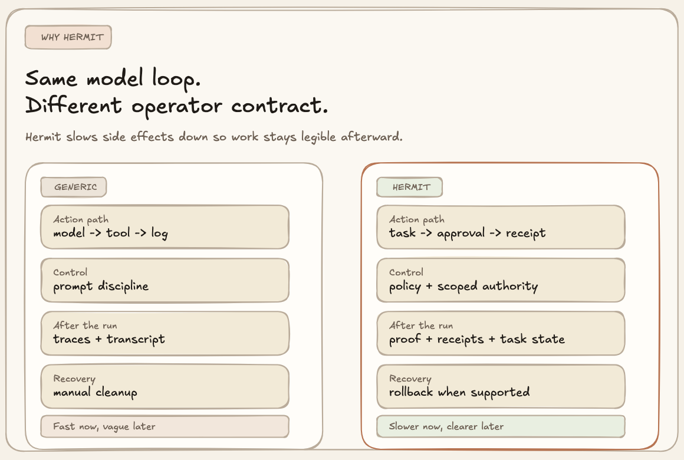
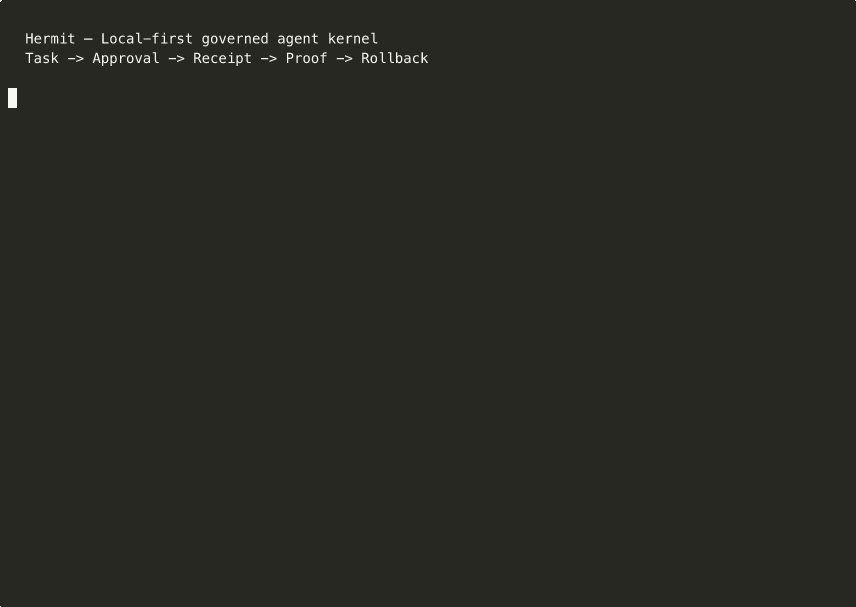
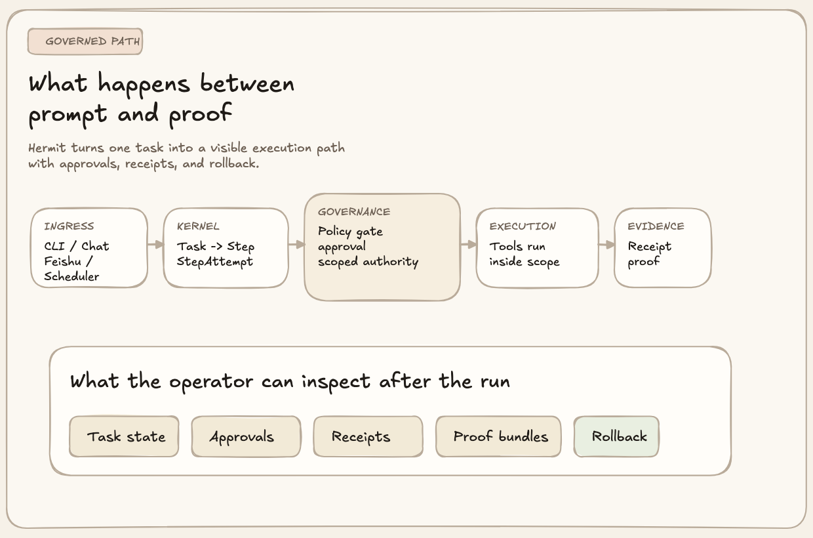
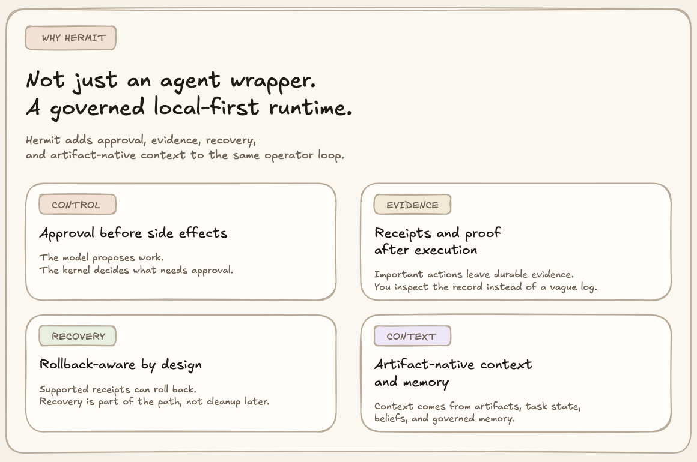
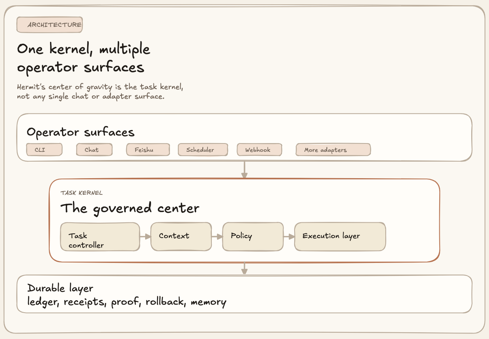

# Hermit

<p align="center">
  
</p>

[English](./README.md) | [简体中文](./README.zh-CN.md)

[](https://github.com/heggria/Hermit/actions/workflows/ci.yml)
[](https://www.python.org/)
[](./LICENSE)
[](https://heggria.github.io/Hermit/)
[](https://pypi.org/project/hermit-agent/)
[](https://pypi.org/project/hermit-agent/)
[](https://discord.gg/XCYqF3SN)
[](https://github.com/heggria/Hermit/discussions)

> **Hermit turns agent work into governed, inspectable, local-first execution.**
>
> Same model loop. Different operator contract: approve before side effects, inspect receipts after execution, and roll back supported actions when needed.

Hermit gives you:

- approvals before consequential actions
- receipts, proof, and task state after the run
- rollback-aware recovery for supported receipt classes

If you want an agent you can inspect, interrupt, approve, audit, and recover locally, that is the point of Hermit.

Hermit is a local-first governed agent kernel for durable, operator-trust-oriented workflows.

Docs site: [heggria.github.io/Hermit](https://heggria.github.io/Hermit/)

## Same Model Loop, Different Operator Contract



Most agent tools optimize for "helpful right now." Hermit optimizes for "still legible after the run."

## Install In One Command

macOS:

```bash
curl -fsSL https://raw.githubusercontent.com/heggria/Hermit/main/install-macos.sh | bash
```

Or via Homebrew:

```bash
brew tap heggria/tap && brew install hermit-agent
```

That installs Hermit, initializes `~/.hermit`, installs the optional menu bar companion, and preserves any provider credentials already present in your shell.

It also tries to sync compatible local settings when Hermit does not already have them:

- Claude Code: imports compatible values from `~/.claude/settings.json` `env`
- Codex: reuses `~/.codex/auth.json` for `codex-oauth` and picks up the model from `~/.codex/config.toml`
- OpenClaw: imports Feishu credentials and default model hints from `~/.openclaw/openclaw.json`

It does not blindly overwrite existing `~/.hermit/.env` values, and it does not auto-convert OpenClaw OAuth tokens into `~/.codex/auth.json`.

## One Task, Still Visible Afterward

Hermit is easiest to understand when one task turns into an inspectable record instead of disappearing into tool logs.

```bash
hermit run "Summarize the current repository and leave a durable task record"
hermit task list
hermit task show <task_id>
hermit task proof <task_id>
hermit task receipts --task-id <task_id>
```

If that task emitted a rollback-capable receipt:

```bash
hermit task rollback <receipt_id>
```

The point of Hermit is not only that the model can do work. The point is that the work stays visible afterward: task state, approvals, receipts, proof material, and supported recovery paths.

If you want a recording-ready walkthrough, start with [docs/demo-flows.md](./docs/demo-flows.md). For runnable scripts, see the [examples/](./examples/) directory.



Real CLI example from this repository's task kernel:


The execution path itself is governed, not implied:



## Why It Feels Different



- durable tasks instead of disposable chat turns
- policy and approvals between the model and side effects
- receipts and proof instead of vague tool logs
- artifact-native context and evidence-bound memory instead of transcript-only state

## What Hermit Actually Is

Most agent systems are optimized to be helpful in the moment. Hermit is optimized to stay legible after the moment.

Most agents treat execution as "the model called a tool." Hermit treats execution as a governed path:

`task -> step -> step attempt -> policy -> approval -> scoped authority -> execution -> receipt -> proof / rollback`

The point is not merely to call tools. The point is to make durable work inspectable, controllable, and recoverable.

### Core ideas

- **Task-first kernel**
  Hermit is not session-first. CLI, chat, scheduler, webhook, and adapters are converging on the same task, step, and step-attempt semantics.

- **Governed execution**
  The model proposes actions. The kernel decides whether they are allowed, whether they need approval, and what authority envelope they get.

- **Receipts, proofs, rollback**
  Tool execution is not the finish line. Important actions produce receipts. Proof summaries and proof bundles make the action chain inspectable. Supported receipts can be rolled back.

- **Artifact-native context**
  Context is more than transcript history. Hermit compiles context packs from artifacts, working state, beliefs, memory records, and task state.

- **Evidence-bound memory**
  Memory is not an ungoverned scratchpad. Durable memory promotion is tied to evidence, scope, retention, and invalidation rules.

- **Local-first operator trust**
  Hermit keeps the operator close to the runtime: local state, visible artifacts, inspectable ledgers, approval surfaces, and recovery paths.

## What Makes Hermit Different

| Instead of... | Hermit emphasizes... |
| --- | --- |
| chat-first sessions | task-first durable work |
| direct model-to-tool execution | policy, approval, and scoped authority |
| transcript as default context | artifacts, beliefs, working state, and memory records |
| tool logs as "audit" | receipts, proof summaries, and exportable proof bundles |
| memory as sticky notes | evidence-bound memory governance |
| keep-going-at-all-costs execution | observation, resolution, and rollback-aware recovery |

Hermit is not trying to be the most productized agent platform. It is trying to be unusually strong at local-first, trust-heavy, inspectable agent execution.

## Why It Is Worth Watching Now

Hermit is still early, but it is already past the "idea only" stage.

Today the repository already ships:

- a real kernel ledger with first-class records for `Task`, `Step`, `StepAttempt`, `Approval`, `Decision`, `Principal`, `CapabilityGrant`, `WorkspaceLease`, `Artifact`, `Receipt`, `Belief`, `MemoryRecord`, `Rollback`, `Conversation`, and `Ingress`
- event-backed task history with hash-chained verification primitives
- governed tool execution with policy evaluation, approval handling, workspace leases, and capability grants
- receipt issuance, proof summaries, proof export, and rollback execution for supported receipts
- local-first runtime surfaces across CLI, long-running `serve`, scheduler, webhook, and Feishu ingress

Current state, stated plainly:

- **Core**, **Governed**, and baseline **Verifiable** kernel profiles are claimable through the conformance matrix and CLI
- **Strong task-level verifiability still depends on proof coverage**: the strongest readiness signal is determined per exported task, not just at the repository level
- **These claims apply to the kernel contract** rather than every compatibility surface or legacy runtime affordance
- **Kernel-first hard cut** is now real for tool governance: builtin tools, plugin tools, delegation tools, and MCP tools must declare explicit governance metadata instead of relying on name-based inference
- **Approval resolution is part of the ledger**: grant and deny transitions now emit decision + receipt records with proof bundles, while `approval.consumed` remains an event-only transition
- **Claimability is surfaced in the product**: CLI/operator views now expose kernel claim status, durable re-entry state, and proof readiness instead of requiring manual source inspection
- **Signed proofs are available as an opt-in profile**: when a local proof signing secret is configured, proof export upgrades to signed bundles with receipt inclusion proofs
- the **`v0.1` kernel spec** is the target architecture, not a claim that every surface is already fully migrated
- the repo now keeps an explicit [kernel conformance matrix](./docs/kernel-conformance-matrix-v0.1.md) so exit-criteria claims are grounded in concrete code paths and tests

## Quick Start

Want the fastest evaluation path? Use the 5-minute flow above, then continue with [Getting started](./docs/getting-started.md) for provider setup, approvals, proof export, and rollback details.

### Requirements

- Python `3.13+`
- [`uv`](https://docs.astral.sh/uv/) recommended
- macOS only: `rumps` for the optional menu bar companion

### Install

```bash
make install
```

This installs Hermit, initializes `~/.hermit`, and copies the basic local environment when available.

You can also install manually:

```bash
uv sync --group dev --group typecheck --group docs --group security --group release
uv run hermit init
```

### First run

Start an interactive session:

```bash
hermit chat
```

Run a one-shot task:

```bash
hermit run "Summarize the current repository"
```

Start the long-running service:

```bash
hermit serve --adapter feishu
```

Inspect the resolved config:

```bash
hermit config show
```

### Kernel inspection commands

Hermit already exposes operator surfaces for the task kernel:

```bash
hermit task list
hermit task show <task_id>
hermit task events <task_id>
hermit task receipts --task-id <task_id>
hermit task proof <task_id>
hermit task proof-export <task_id>
hermit task approve <approval_id>
hermit task rollback <receipt_id>
```

These commands matter because a task does not end at tool execution; it ends with an inspectable outcome.

## Architecture At A Glance



The current repo still contains runtime-era layers and operational surfaces. But the architectural center of gravity is shifting toward the task kernel and its governance law.

For the current implementation, see [docs/architecture.md](./docs/architecture.md).
For the target design, see [docs/kernel-spec-v0.1.md](./docs/kernel-spec-v0.1.md).

## Use Cases

Hermit is especially interesting when the work is:

- long-running
- local-first
- interruptible
- approval-sensitive
- stateful across turns
- worth auditing later

Examples:

- a local coding agent that should ask before writing outside the workspace
- a scheduled assistant that produces artifacts and keeps an inspectable task ledger
- a channel-connected operator assistant where approvals and task continuity matter
- a memory-bearing personal runtime where durable memory should cite evidence

Suggested homepage assets:

- a screenshot of `hermit task show` with approvals, capability grants, workspace leases, and receipts visible
- a short terminal capture of `hermit task proof` and `hermit task rollback`
- an architecture diagram showing the governed execution path

## Documentation Map

For a lightweight reading surface on GitHub, use the [project wiki](https://github.com/heggria/Hermit/wiki). The canonical source of truth remains this repository's `README.md` and `docs/`.

- [Wiki](https://github.com/heggria/Hermit/wiki)
- [Getting started](./docs/getting-started.md)
- [Demo flows](./docs/demo-flows.md)
- [Why Hermit](./docs/why-hermit.md)
- [Design Philosophy](./docs/design-philosophy.md)
- [Comparisons](./docs/comparisons.md)
- [Architecture](./docs/architecture.md)
- [Kernel spec v0.1](./docs/kernel-spec-v0.1.md)
- [Kernel spec section checklist](./docs/kernel-spec-v0.1-section-checklist.md)
- [Kernel conformance matrix v0.1](./docs/kernel-conformance-matrix-v0.1.md)
- [Governance](./docs/governance.md)
- [Receipts and proofs](./docs/receipts-and-proofs.md)
- [Context model](./docs/context-model.md)
- [Memory model](./docs/memory-model.md)
- [Task lifecycle](./docs/task-lifecycle.md)
- [Operator guide](./docs/operator-guide.md)
- [Roadmap](./docs/roadmap.md)
- [Status and compatibility](./docs/status-and-compatibility.md)
- [Use cases](./docs/use-cases.md)
- [CLI and operations](./docs/cli-and-operations.md)
- [Configuration](./docs/configuration.md)
- [OpenClaw comparison](./docs/openclaw-comparison.md)
- [FAQ](./docs/faq.md)

## Roadmap

Near-term direction:

- finish converging all ingress paths on task, step, and step-attempt semantics
- tighten the governed execution path across more effectful surfaces
- deepen receipt coverage and proof export semantics
- mature rollback support beyond the current supported actions
- make artifact-native context and evidence-bound memory easier to inspect
- align package metadata, docs, and repo language around the kernel thesis

See [docs/roadmap.md](./docs/roadmap.md) for the current status and milestones.

## Community

- [Discord](https://discord.gg/XCYqF3SN) — real-time chat and support
- [GitHub Discussions](https://github.com/heggria/Hermit/discussions) — questions, ideas, and general conversation
- [Issues](https://github.com/heggria/Hermit/issues) — bug reports and feature requests

## Contributing

Hermit is still early enough that architecture-sensitive contributions matter.

Good contribution areas:

- task kernel semantics
- governance and approval flow
- receipts, proof export, and rollback coverage
- artifact and context handling
- memory governance
- docs that clarify current state vs target state

Start with:

- [CONTRIBUTING.md](./CONTRIBUTING.md)
- [docs/architecture.md](./docs/architecture.md)
- [docs/kernel-spec-v0.1.md](./docs/kernel-spec-v0.1.md)
- [docs/roadmap.md](./docs/roadmap.md)

## License

MIT
