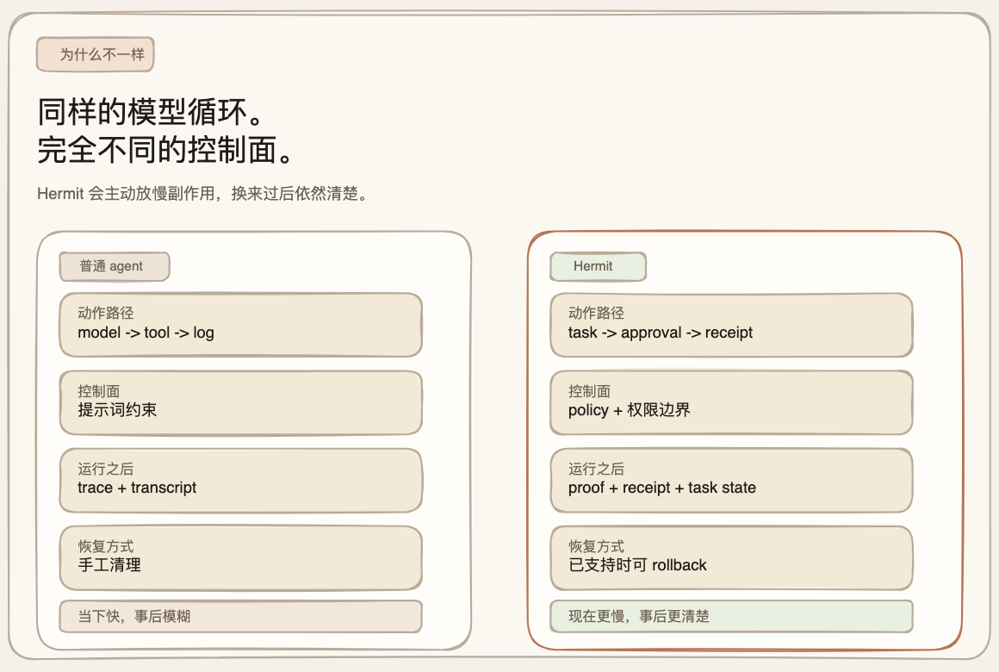
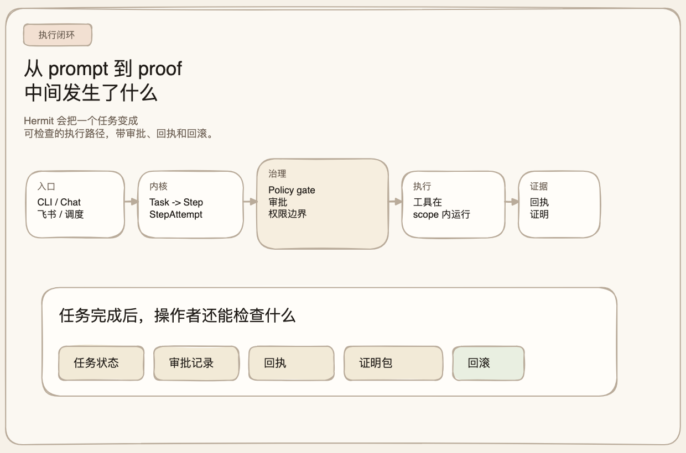
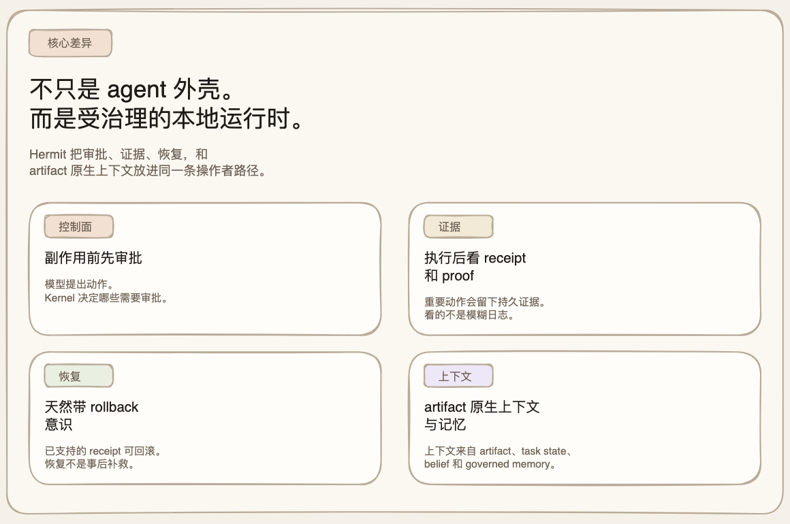
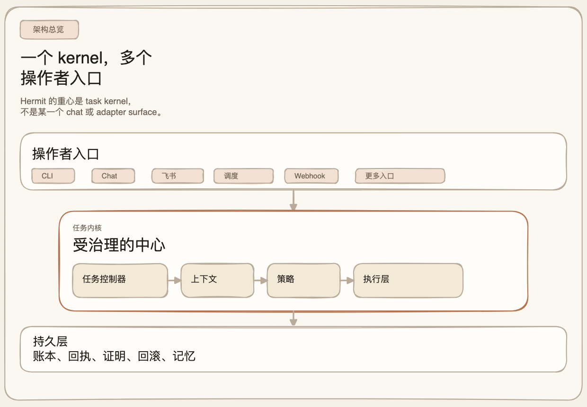

# Hermit

<p align="center">
  <picture>
    <source media="(prefers-color-scheme: dark)" srcset="./docs/assets/hermit-icon-white.svg">
    <source media="(prefers-color-scheme: light)" srcset="./docs/assets/hermit-macos-icon.svg">
    
  </picture>
</p>

[English](./README.md) | [简体中文](./README.zh-CN.md)

[](https://github.com/heggria/Hermit/actions/workflows/ci.yml)
[](https://www.python.org/)
[](./LICENSE)
[](https://heggria.github.io/Hermit/)
[](https://pypi.org/project/hermit-agent/)
[](https://pypi.org/project/hermit-agent/)
[](https://discord.gg/XCYqF3SN)
[](https://github.com/heggria/Hermit/discussions)

> **Hermit 把 agent 工作变成一条可治理、可检查、可本地掌控的执行路径。**
>
> 同样是模型循环，但操作者拿到的是另一种控制面：副作用前先审批，执行后看 receipt，需要时还能对已支持动作回滚。

Hermit 提供的不是“会聊天的工具壳”，而是一条更可控的执行路径：

- 关键动作先走审批
- 执行完成后留下 receipt、proof 和 task state
- 对已支持的 receipt class 提供 rollback-aware recovery

如果你想要的是一个可以本地运行、可以中断、可以审批、可以审计、也可以追溯恢复的 Agent，Hermit 的价值就在这里。

文档站点：[heggria.github.io/Hermit](https://heggria.github.io/Hermit/)

## 同样的模型循环，完全不同的控制面



大多数 agent 工具优化的是“当下够好用”。Hermit 优化的是“过后依然看得清”。

## 一条命令安装

仅限 macOS：

```bash
curl -fsSL https://raw.githubusercontent.com/heggria/Hermit/main/install-macos.sh | bash
```

这个安装脚本会完成这些事：

- 安装 Hermit
- 初始化 `~/.hermit`
- 安装可选的 macOS 菜单栏伴侣
- 尝试保留你当前 shell 里已有的 provider 凭据

它还会在 Hermit 自己还没有这些值时，尽量同步兼容来源里的配置：

- Claude Code：从 `~/.claude/settings.json` 的 `env` 中导入兼容字段
- Codex：直接复用 `~/.codex/auth.json` 作为 `codex-oauth`，并从 `~/.codex/config.toml` 读取模型
- OpenClaw：从 `~/.openclaw/openclaw.json` 导入 Feishu 凭据和默认模型提示

它不会覆盖现有的 `~/.hermit/.env`，也不会把 OpenClaw 的 OAuth token 自动改写成 `~/.codex/auth.json`。

## 一次任务，过后还能看清

Hermit 最容易理解的方式，是看一个任务如何变成“可检查的记录”，而不是执行完就消失在工具日志里。

```bash
hermit run "Summarize the current repository and leave a durable task record"
hermit task list
hermit task show <task_id>
hermit task proof <task_id>
hermit task receipts --task-id <task_id>
```

如果这个任务产出了可回滚的 receipt：

```bash
hermit task rollback <receipt_id>
```

Hermit 关心的不只是“模型把事情做了”，而是“事情做完之后，你还能看见什么、确认什么、恢复什么”。

如果你想录屏或做展示，先看 [docs/demo-flows.md](./docs/demo-flows.md)。可运行的示例脚本在 [examples/](./examples/) 目录。


下面这张图使用仓库内真实生成的 CLI 输出：


Hermit 真正特别的地方，不只是能把任务跑完，而是这条执行路径本身就带治理：



## 为什么会有这种手感



- 它把工作当成持久任务，而不是一次性聊天回合
- 它在模型和副作用之间放入 policy、approval 和 scoped authority
- 它用 receipt 和 proof 来收尾，而不是模糊的工具调用日志
- 它把 artifact-native context 和 evidence-bound memory 留在可检查的表面上

## Hermit 到底是什么

大多数 Agent 系统追求的是“此刻足够有帮助”。Hermit 更在意的是“过后依然看得清楚”。

很多系统把执行理解成“模型调用了工具”。Hermit 更强调这条受治理的路径：

`task -> step -> step attempt -> policy -> approval -> scoped authority -> execution -> receipt -> proof / rollback`

重点不只是把工具调起来，而是让长期工作变得可检查、可控制、可恢复。

### 核心概念

- **Task-first kernel**
  Hermit 不是 session-first。CLI、chat、scheduler、webhook、adapter 都在收敛到统一的 task / step / step-attempt 语义上。

- **Governed execution**
  模型提出动作，kernel 决定这个动作是否允许、是否需要审批、以及能拿到什么权限边界。

- **Receipts, proofs, rollback**
  工具执行不是终点。重要动作会留下 receipt，proof summary 和 proof bundle 让链路可检查；部分 receipt class 支持 rollback。

- **Artifact-native context**
  上下文不只是 transcript。Hermit 会把 artifact、working state、belief、memory record 和 task state 一起编排进上下文。

- **Evidence-bound memory**
  Memory 不是随手贴便签。持久记忆的提升、保留、失效和覆盖，都应该和证据、作用域、生命周期绑定。

- **Local-first operator trust**
  运行时尽量离操作者更近：本地状态、可见 artifact、可检查 ledger、审批界面和恢复路径都尽量留在本地。

## 当前已经有什么

Hermit 还很早，但已经不是“只有想法”的阶段。

仓库当前已经有：

- 一套真正的 kernel ledger，对 `Task`、`Step`、`StepAttempt`、`Approval`、`Decision`、`Principal`、`CapabilityGrant`、`WorkspaceLease`、`Artifact`、`Receipt`、`Belief`、`MemoryRecord`、`Rollback`、`Conversation`、`Ingress` 等对象进行持久化
- 基于事件的 task history 和 hash-chained verification primitives
- 带 policy evaluation、approval handling、workspace lease 和 capability grant 的 governed tool execution
- receipt issuance、proof summary、proof export，以及对已支持 receipt 的 rollback
- CLI、长运行 `serve`、scheduler、webhook、Feishu ingress 等本地运行表面

当前状态需要说得直接一些：

- **Core**、**Governed** 和 baseline **Verifiable** 已经可以通过 conformance matrix 与 CLI claim
- **Strong task-level verifiability** 仍然取决于具体 task 的 proof coverage，而不是仓库级口号
- **这些 claim 针对 kernel contract**，不是对所有兼容表面都已经完全收敛的表述
- **`v0.1` kernel spec** 代表目标架构，不代表所有表面都已经迁移完成

## 快速开始

如果你只是想最快评估，先跑上面的 demo 流程；如果想完整配置 provider、审批、proof export 和 rollback，再继续看 [docs/getting-started.md](./docs/getting-started.md)。

### 运行要求

- Python `3.11+`
- 推荐使用 [`uv`](https://docs.astral.sh/uv/)
- 如果要用 macOS 菜单栏伴侣，需要 `rumps`

### 安装

```bash
make install
```

或者手动安装：

```bash
uv sync --group dev --group typecheck --group docs --group security --group release
uv run hermit init
```

### 首次运行

交互式对话：

```bash
hermit chat
```

一次性任务：

```bash
hermit run "Summarize the current repository"
```

启动长运行服务：

```bash
hermit serve --adapter feishu
```

查看当前配置：

```bash
hermit config show
hermit auth status
```

### 常用 Kernel 检查命令

```bash
hermit task list
hermit task show <task_id>
hermit task events <task_id>
hermit task receipts --task-id <task_id>
hermit task proof <task_id>
hermit task proof-export <task_id>
hermit task approve <approval_id>
hermit task rollback <receipt_id>
```

这些命令的意义在于：任务不会在工具执行结束时消失，而会留下可以继续检查的结果表面。

## 文档入口

如果你想先理解“它为什么和一般 agent runtime 不一样”，建议先看这张总览图：



推荐从这里开始：

- [快速上手（中文）](./docs/getting-started.zh-CN.md)
- [为什么选择 Hermit（中文）](./docs/why-hermit.zh-CN.md)
- [docs/getting-started.md](./docs/getting-started.md)
- [docs/demo-flows.md](./docs/demo-flows.md)
- [docs/why-hermit.md](./docs/why-hermit.md)
- [docs/design-philosophy.md](./docs/design-philosophy.md)
- [docs/comparisons.md](./docs/comparisons.md)
- [docs/architecture.md](./docs/architecture.md)
- [docs/governance.md](./docs/governance.md)
- [docs/receipts-and-proofs.md](./docs/receipts-and-proofs.md)
- [docs/roadmap.md](./docs/roadmap.md)

目前更深的 `docs/` 文档仍以英文为主；这个中文 README 负责提供一个完整的中文入口页。

## 社区

- [Discord](https://discord.gg/XCYqF3SN) — 实时聊天和支持
- [GitHub Discussions](https://github.com/heggria/Hermit/discussions) — 提问、交流想法
- [Issues](https://github.com/heggria/Hermit/issues) — Bug 反馈和功能建议

## 许可证

[MIT](./LICENSE)
