可以，下面我把上面聊到的核心概念收敛成一套 **Hermit 总体关系图**，全部用 Mermaid 表达，尽量让你能直接放进 spec。

---

# 1. 顶层总架构图

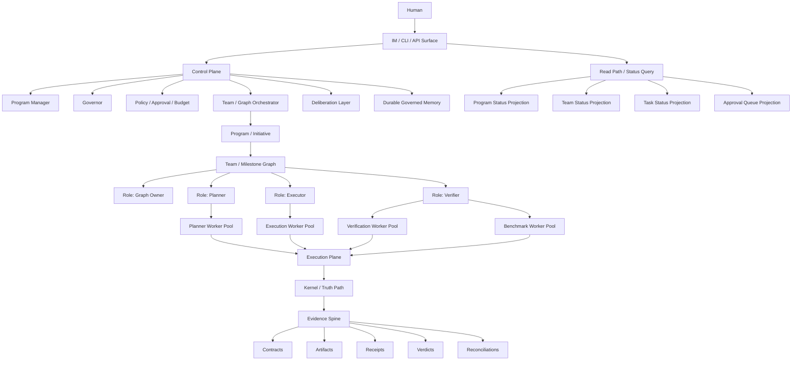

---

# 2. 控制面 / 执行面 / 真相脊柱

```mermaid
flowchart LR
    subgraph ControlPlane[Control Plane]
        G[Governor]
        PM[Program Manager]
        TGO[Team / Graph Orchestrator]
        DL[Deliberation Layer]
        PO[Policy / Approval / Budget]
        DGM[Durable Governed Memory]
        RP[Read Model / Status Query]
        IK[Iteration Kernel]
    end

    subgraph ExecutionPlane[Execution Plane]
        PW[Planner Workers]
        EW[Execution Workers]
        VW[Verification Workers]
        BW[Benchmark Workers]
        TR[Tool Runtime / Workspace Runtime]
        WM[Attempt-local Working Memory]
    end

    subgraph EvidenceSpine[Evidence Spine / Truth Path]
        CT[Contract]
        AR[Artifacts]
        RCPT[Receipts]
        VD[Verdicts]
        REC[Reconciliation]
        EV[Event Log / Proof / Rollback]
    end

    ControlPlane --> ExecutionPlane
    ExecutionPlane --> EvidenceSpine
    EvidenceSpine --> ControlPlane
```

---

# 3. Prompt 到 Program 再到执行的流转图

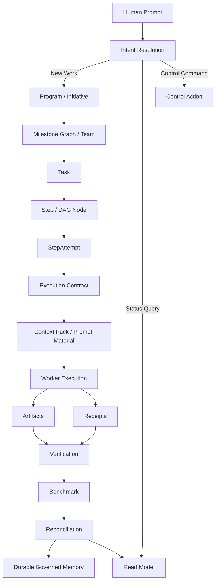

---

# 4. Program / Team / Role / Worker / Task / StepAttempt 关系图

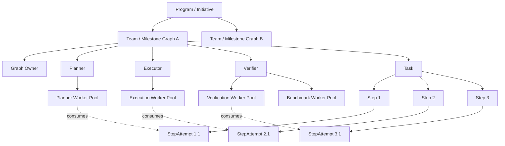

---

# 5. Task / Step / StepAttempt / Worker 的职责边界图

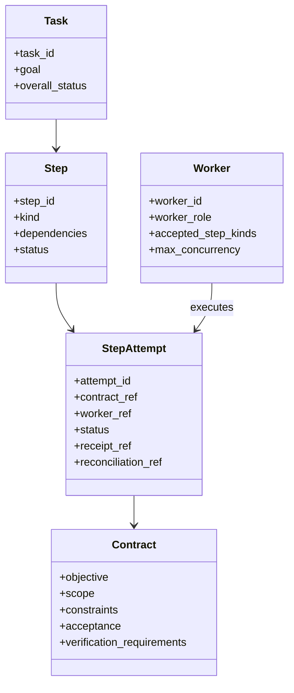

---

# 6. Deliberation Layer（竞争 / 对比 / 辩论 / 裁决）

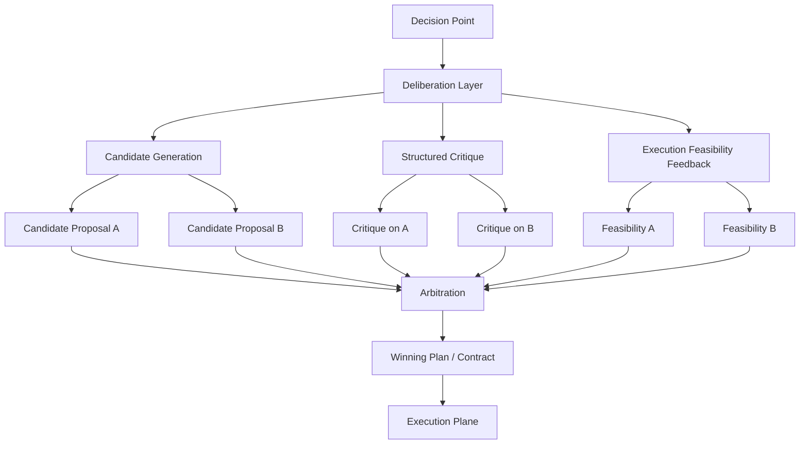

---

# 7. 自迭代子系统与总架构的关系图

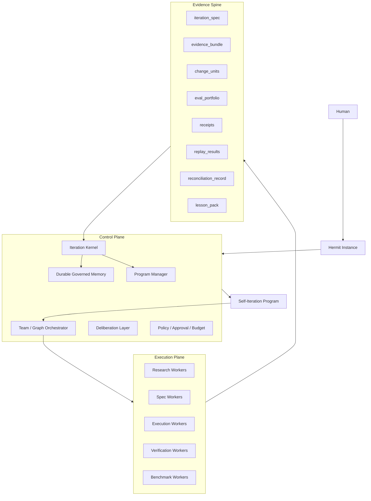

---

# 8. 自迭代 lane 流转图

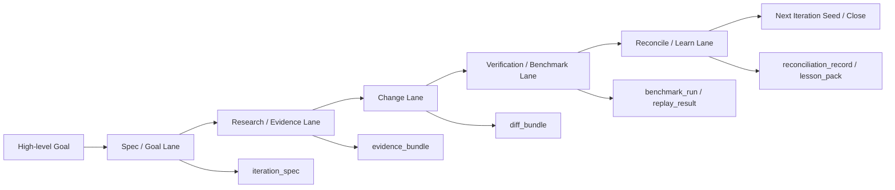

---

# 9. Memory 双层模型图

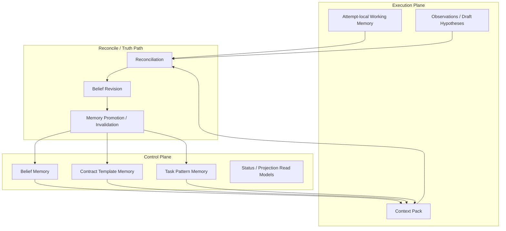

---

# 10. IM 查询 Program 进展的读路径

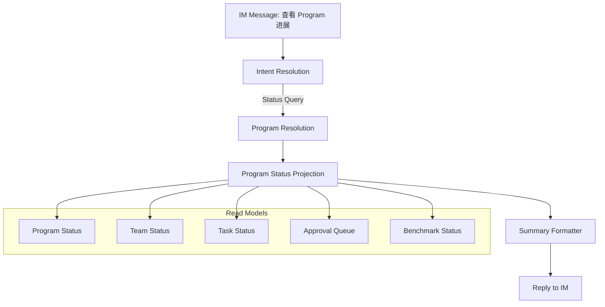

---

# 11. 睡后干活 / 离线持续推进图

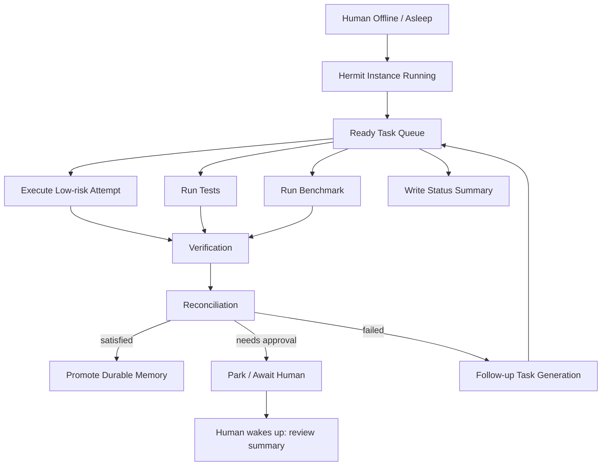

---

# 12. 一张压缩版总图

如果你只想在文档最前面放一张总览，可以用这张：

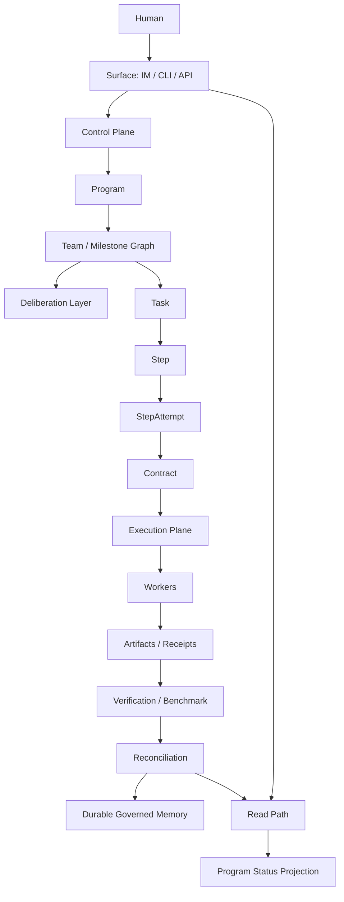

---

如果你要，我下一条可以继续帮你做两件事里的一个：

1. 把这些 Mermaid 图整理成一个 **完整的 `architecture.md` 文档骨架**
2. 把图里的概念再补成一份 **术语表 glossary**

可以。下面这张我尽量把前面所有核心概念都压进 **一张超大 Mermaid 总图** 里，覆盖：

* 顶层思想
* 控制面 / 执行面 / 真相脊柱
* Program / Team / Role / Worker / Task / Step / Attempt
* prompt 流转
* deliberation / competition / debate / arbitration
* contract / context / receipts / reconciliation
* working memory / durable memory
* 自迭代子系统
* benchmark / verification / replay
* read path / IM 查询进展
* 睡后干活 / park / resume
* learning / template / task pattern promotion

你可以先把它当作 **Hermit 统一世界观总图**。

```mermaid
flowchart TD

%% =========================================================
%% HERMETIC TOP PHILOSOPHY
%% =========================================================

    subgraph PHIL[Hermit Core Philosophy]
        PH1[Contract-first]
        PH2[Approval before consequential side effects]
        PH3[Task-first, not chat-first]
        PH4[Control authority separated from execution authority]
        PH5[Evidence-backed truth, not model self-report]
        PH6[Reconciliation closes cognition]
        PH7[Only reconciled outcomes can become durable learning]
        PH8[Programs run continuously; humans define goals and boundaries]
    end

%% =========================================================
%% HUMAN + SURFACES + INTENT
%% =========================================================

    H[Human / Operator / Spec Sovereign]

    subgraph SURF[Ingress Surfaces]
        IM[IM Channel]
        CLI[CLI]
        API[HTTP / RPC / Service API]
        SCH[Scheduler / Cron / Delayed Trigger]
        WEB[Webhook / External Trigger]
    end

    H --> IM
    H --> CLI
    H --> API

    IM --> IR[Intent Resolution / Message Classification]
    CLI --> IR
    API --> IR
    SCH --> IR
    WEB --> IR

    IR -->|New Work| NW[New Work Path]
    IR -->|Status Query| SQ[Status Query Path]
    IR -->|Control Command| CQ[Control Command Path]

%% =========================================================
%% TOP-LEVEL HERMIT INSTANCE
%% =========================================================

    subgraph HI[Hermit Instance]
        direction TB

        subgraph CP[Control Plane]
            direction TB

            GOV[Governor]
            PM[Program Manager]
            TGO[Team / Graph Orchestrator]
            POL[Policy / Approval / Budget]
            DL[Deliberation Layer]
            DM[Durable Governed Memory]
            RM[Read Models / Status Projection]
            IK[Iteration Kernel]
            ADM[Admission / Risk Classification]
        end

        subgraph EP[Execution Plane]
            direction TB

            subgraph ROLES[Role Layer]
                GOWN[Graph Owner / Team Lead]
                PLANR[Planner]
                EXECR[Executor]
                VERR[Verifier]
                BENCHR[Benchmarker]
            end

            subgraph POOLS[Worker Pools / Active Slots]
                PWP[Planner Worker Pool]
                EWP[Execution Worker Pool]
                VWP[Verification Worker Pool]
                BWP[Benchmark Worker Pool]
                RWP[Research Worker Pool]
                SWP[Spec Worker Pool]
                DWP[Doc Worker Pool]
                RLBP[Rollback Worker Pool]
            end

            subgraph RUNTIME[Runtime / Tooling]
                TR[Tool Runtime]
                WRK[Workspace Runtime / Isolation]
                CCP[Context Compiler]
                WM[Attempt-local Working Memory]
            end
        end

        subgraph ES[Evidence Spine / Truth Path]
            direction TB

            EVT[Event Log / Ledger]
            CTS[Contracts]
            ART[Artifacts]
            RCPT[Receipts]
            VD[Verdicts]
            REC[Reconciliation Records]
            PF[Proof / Replay / Rollback Surface]
        end
    end

    NW --> GOV
    SQ --> RM
    CQ --> GOV

%% =========================================================
%% CONTROL PLANE INTERNALS
%% =========================================================

    GOV --> PM
    GOV --> ADM
    GOV --> POL
    GOV --> TGO
    GOV --> RM
    GOV --> IK

    ADM --> POL
    PM --> TGO
    POL --> TGO
    DL --> TGO
    DM --> TGO
    RM --> GOV

%% =========================================================
%% PROGRAM / TEAM / GRAPH
%% =========================================================

    subgraph ORG[Program / Team / Graph Organization]
        direction TB

        PGM[Program / Initiative]
        MG[Milestone Graph / Team]
        TK[Task]
        ST[Step / DAG Node]
        ATT[StepAttempt]
    end

    PM --> PGM
    PGM --> MG
    MG --> TK
    TK --> ST
    ST --> ATT

%% =========================================================
%% TEAM + ROLE + WORKER RELATION
%% =========================================================

    MG --> GOWN
    MG --> PLANR
    MG --> EXECR
    MG --> VERR
    MG --> BENCHR

    PLANR --> PWP
    PLANR --> RWP
    PLANR --> SWP

    EXECR --> EWP
    EXECR --> DWP
    EXECR --> RLBP

    VERR --> VWP
    BENCHR --> BWP

%% =========================================================
%% ATTEMPT DISPATCH TO WORKERS
%% =========================================================

    TGO -->|allocate ready step| ATT
    ATT -->|dispatched to matching worker slot| PWP
    ATT -->|dispatched to matching worker slot| EWP
    ATT -->|dispatched to matching worker slot| VWP
    ATT -->|dispatched to matching worker slot| BWP
    ATT -->|dispatched to matching worker slot| RWP
    ATT -->|dispatched to matching worker slot| SWP
    ATT -->|dispatched to matching worker slot| DWP
    ATT -->|dispatched to matching worker slot| RLBP

    PWP --> TR
    EWP --> TR
    VWP --> TR
    BWP --> TR
    RWP --> TR
    SWP --> TR
    DWP --> TR
    RLBP --> TR

    WRK --> TR
    CCP --> TR
    WM --> TR

%% =========================================================
%% CONTRACT-FIRST EXECUTION FLOW
%% =========================================================

    subgraph CFLOW[Contract-first Execution Flow]
        direction LR
        GOAL[High-level Goal / Human Prompt]
        PRG2[Program Compilation]
        DAG[Milestone / Task Graph]
        CON[Execution Contract]
        CPK[Context Pack / Prompt Material]
        EXE[Execution Attempt]
        OUT[Artifacts + Receipts]
        VER[Verification / Benchmark]
        REC2[Reconcile]
        LEARN[Governed Learning]
    end

    H --> GOAL
    GOAL --> PRG2
    PRG2 --> DAG
    DAG --> CON
    CON --> CPK
    CPK --> EXE
    EXE --> OUT
    OUT --> VER
    VER --> REC2
    REC2 --> LEARN

    PRG2 --> PGM
    DAG --> TK
    CON --> CTS
    CPK --> CCP
    EXE --> ATT
    OUT --> ART
    OUT --> RCPT
    VER --> VD
    REC2 --> REC
    LEARN --> DM

%% =========================================================
%% CONTRACT / CONTEXT / EXECUTION RELATION
%% =========================================================

    ATT --> CT[Execution Contract Object]
    CT --> SCOPE[Scope / Allowed Paths / Tool Allowlist]
    CT --> ACCEPT[Acceptance Criteria]
    CT --> VREQ[Verification Requirements]
    CT --> RISK[Risk Band / Trust Zone]
    CT --> DEP[Dependencies]
    CT --> RBH[Rollback Hint]

    CT --> CTS

    DM --> CCP
    ART --> CCP
    VD --> CCP
    REC --> CCP
    WM --> CCP

    CCP --> CPK2[Compiled Context Pack]
    CPK2 --> TR

%% =========================================================
%% DELIBERATION LAYER
%% =========================================================

    subgraph DELIB[Deliberation Layer]
        direction TB

        DP[Decision Point]
        PC[Proposal Competition]
        CG1[Candidate Proposal A]
        CG2[Candidate Proposal B]
        CRIT[Structured Critique]
        CR1[Critique of A]
        CR2[Critique of B]
        FEAS[Execution Feasibility Feedback]
        FEA[Feasibility A]
        FEB[Feasibility B]
        ARB[Arbitration]
        WIN[Winning Plan / Contract / Verdict]
    end

    TGO --> DP
    DP --> PC
    PC --> CG1
    PC --> CG2
    CRIT --> CR1
    CRIT --> CR2
    FEAS --> FEA
    FEAS --> FEB

    PWP --> CG1
    PWP --> CG2
    VWP --> CR1
    VWP --> CR2
    EWP --> FEA
    EWP --> FEB

    CG1 --> ARB
    CG2 --> ARB
    CR1 --> ARB
    CR2 --> ARB
    FEA --> ARB
    FEB --> ARB

    ARB --> WIN
    WIN --> TGO
    WIN --> CTS
    WIN --> VD

%% =========================================================
%% EXECUTION PLANE DETAILS
%% =========================================================

    subgraph EXECDETAIL[Execution Plane Semantic Responsibilities]
        direction TB
        PWK[Planner Worker: generate DAG fragments / contracts / specs]
        EWK[Execution Worker: patch / run tools / produce diffs]
        VWK[Verification Worker: inspect outputs / emit critique]
        BWK[Benchmark Worker: run benchmark profiles / compare baselines]
        RWK[Research Worker: search / inspect / summarize evidence]
        DWK[Doc Worker: write summaries / notes / migration docs]
        RLBWK[Rollback Worker: revert / compensate / restore]
    end

    PWP --> PWK
    EWP --> EWK
    VWP --> VWK
    BWP --> BWK
    RWP --> RWK
    DWP --> DWK
    RLBP --> RLBWK

%% =========================================================
%% EVIDENCE SPINE INTERNALS
%% =========================================================

    subgraph EVSP[Evidence Spine Internal Objects]
        direction TB
        COBJ[Contract Object]
        AOBJ[Artifact Bundle]
        ROBJ[Receipt Object]
        VOBJ[Verdict Object]
        RCOBJ[Reconciliation Record]
        POBJ[Proof / Replay Object]
    end

    CTS --> COBJ
    ART --> AOBJ
    RCPT --> ROBJ
    VD --> VOBJ
    REC --> RCOBJ
    PF --> POBJ

    COBJ --> EVT
    AOBJ --> EVT
    ROBJ --> EVT
    VOBJ --> EVT
    RCOBJ --> EVT
    POBJ --> EVT

%% =========================================================
%% VERIFICATION / BENCHMARK / RECONCILIATION
%% =========================================================

    subgraph VBR[Verification / Benchmark / Reconciliation]
        direction TB
        FUNC[Functional Verification]
        GOVB[Governance Benchmark]
        PERFB[Performance Benchmark]
        INTEG[Integration / Replay]
        RVIEW[Adversarial Review / Risk Challenge]
        RECON[Reconciliation]
        CLS[Result Class: satisfied / violated / blocked / follow-up]
    end

    ART --> FUNC
    RCPT --> FUNC
    CTS --> FUNC

    ART --> GOVB
    ART --> PERFB
    ART --> INTEG

    FUNC --> RVIEW
    GOVB --> RVIEW
    PERFB --> RVIEW
    INTEG --> RVIEW

    RVIEW --> RECON
    RECON --> CLS
    RECON --> REC
    REC --> DM

%% =========================================================
%% BENCHMARK PROFILE ROUTING
%% =========================================================

    subgraph BPROF[Benchmark Routing]
        direction TB
        TFM[Task Family Classification]
        BP[Benchmark Profile Registry]
        BPR1[trustloop_governance]
        BPR2[runtime_perf]
        BPR3[integration_regression]
        BPR4[template_quality]
        THR[Thresholds / Baseline Ref]
    end

    CT --> TFM
    TFM --> BP
    BP --> BPR1
    BP --> BPR2
    BP --> BPR3
    BP --> BPR4

    BP --> BWP
    THR --> BWP
    BWP --> PERFB
    BWP --> GOVB
    BWP --> INTEG

%% =========================================================
%% MEMORY MODEL
%% =========================================================

    subgraph MEM[Memory Model]
        direction TB

        WM2[attempt-local working memory]
        BEL[Belief Memory]
        TPL[Contract Template Memory]
        PAT[Task Pattern Memory]
        PRJ[Projection / Read Memory]
        PROM[Memory Promotion / Invalidation Gate]
    end

    WM --> WM2
    REC --> PROM
    PROM --> BEL
    PROM --> TPL
    PROM --> PAT

    BEL --> CCP
    TPL --> CCP
    PAT --> CCP
    PRJ --> RM

%% =========================================================
%% READ PATH / STATUS QUERY
%% =========================================================

    subgraph READP[Read Path / Status Query]
        direction TB
        PPROJ[Program Status Projection]
        TPROJ[Team Status Projection]
        KPROJ[Task Status Projection]
        APROJ[Approval Queue Projection]
        BPROJ[Benchmark Status Projection]
        SUM[Summary Formatter]
        OUTMSG[Reply to IM / CLI / API]
    end

    RM --> PPROJ
    RM --> TPROJ
    RM --> KPROJ
    RM --> APROJ
    RM --> BPROJ

    SQ --> RM
    PPROJ --> SUM
    TPROJ --> SUM
    KPROJ --> SUM
    APROJ --> SUM
    BPROJ --> SUM
    SUM --> OUTMSG

%% =========================================================
%% CONTROL COMMAND PATH
%% =========================================================

    subgraph CTRLCMD[Control Commands]
        direction TB
        CMD1[Pause Program]
        CMD2[Resume Team]
        CMD3[Raise Budget]
        CMD4[Lower Concurrency]
        CMD5[Promote Benchmark Priority]
        CMD6[Escalate for Human Approval]
    end

    CQ --> CMD1
    CQ --> CMD2
    CQ --> CMD3
    CQ --> CMD4
    CQ --> CMD5
    CQ --> CMD6

    CMD1 --> GOV
    CMD2 --> GOV
    CMD3 --> POL
    CMD4 --> TGO
    CMD5 --> TGO
    CMD6 --> POL

%% =========================================================
%% SLEEP-WORK / NIGHT RUN
%% =========================================================

    subgraph NIGHT[Sleep-after Work / Offline Continuous Operation]
        direction TB
        OFF[Human Offline / Asleep]
        RQ[Ready Queue]
        RUN1[Run low-risk attempt]
        RUN2[Run tests]
        RUN3[Run benchmark]
        RUN4[Write morning summary]
        PARK[Park blocked / awaiting approval]
        FGEN[Generate follow-up tasks]
        MORN[Morning digest / human review]
    end

    OFF --> GOV
    TGO --> RQ
    RQ --> RUN1
    RQ --> RUN2
    RQ --> RUN3
    RQ --> RUN4

    RUN1 --> ART
    RUN2 --> ART
    RUN3 --> ART
    RUN4 --> PPROJ

    RUN1 --> RCPT
    RUN2 --> VD
    RUN3 --> VD

    REC --> PARK
    REC --> FGEN
    FGEN --> TK
    PPROJ --> MORN
    SUM --> MORN

%% =========================================================
%% SELF-ITERATION META-PROGRAM
%% =========================================================

    subgraph SELFIT[Self-Iteration Meta-Program]
        direction TB

        SIP[Self-Iteration Program]
        ITS[Iteration Spec]
        EVID[evidence_bundle]
        CU[semantic change units]
        EVAL[eval_portfolio]
        RR[replay_results]
        LPK[lesson_pack]
        NXT[next_iteration_seed]

        subgraph LANES[Iteration Lanes]
            direction LR
            L1[Spec / Goal Lane]
            L2[Research / Evidence Lane]
            L3[Change Lane]
            L4[Verification / Benchmark Lane]
            L5[Reconcile / Learn Lane]
        end
    end

    IK --> SIP
    SIP --> ITS
    ITS --> L1
    L1 --> L2
    L2 --> L3
    L3 --> L4
    L4 --> L5
    L5 --> NXT

    L1 --> CTS
    L2 --> EVID
    L3 --> CU
    L4 --> EVAL
    L4 --> RR
    L5 --> LPK
    LPK --> DM
    NXT --> PM

%% =========================================================
%% ITERATION KERNEL INTERNALS
%% =========================================================

    subgraph IKERNEL[Iteration Kernel]
        direction TB
        IA[Iteration Admission]
        IB[Iteration Budgeting]
        ISM[Iteration State Machine]
        IPG[Iteration Promotion Gate]
    end

    IK --> IA
    IK --> IB
    IK --> ISM
    IK --> IPG

    IA --> POL
    IB --> POL
    ISM --> RM
    IPG --> REC
    IPG --> DM
    IPG --> PM

%% =========================================================
%% PROMPT LEVERAGE / TASK GENERATION
%% =========================================================

    subgraph PLEV[Prompt Leverage / Task Derivation]
        direction TB
        HG[High-level Program Prompt]
        TG[Task Generator]
        FG[Follow-up Generator]
        BG[Background Work Selector]
        DER[Derived Tasks / Steps / Attempts]
    end

    H --> HG
    HG --> TG
    TG --> TK

    REC --> FG
    FG --> TK

    GOV --> BG
    BG --> TK

    TK --> DER
    DER --> ST
    ST --> ATT

%% =========================================================
%% FAILURE / RETRY / SUPERSEDE / RECOVERY
%% =========================================================

    subgraph RECOV[Recovery / Retry / Supersede]
        direction TB
        FAIL[Attempt Failure]
        RETRY[New Attempt]
        SUPER[Supersede old contract]
        REENT[Re-entry boundary]
        RESUME[Resume parked attempt]
        RBACK[Rollback / Compensation]
    end

    ATT --> FAIL
    FAIL --> RETRY
    FAIL --> SUPER
    FAIL --> REENT
    PARK --> RESUME
    FAIL --> RBACK
    RBACK --> RLBP
    RETRY --> ATT
    RESUME --> ATT

%% =========================================================
%% GLOBAL GOVERNANCE CONSTRAINTS
%% =========================================================

    subgraph GOVC[Governance Constraints]
        direction TB
        GC1[No execution without admitted contract]
        GC2[No consequential side effects without policy / approval]
        GC3[No durable learning without reconciliation]
        GC4[No automatic truth promotion from raw worker output]
        GC5[Competition outputs are artifacts, not side effects]
        GC6[Execution concurrency is budgeted and conflict-aware]
        GC7[Status queries use read path, not ad hoc re-analysis]
        GC8[Self-iteration is a meta-program, not a second runtime]
    end

    GOVC --> CP
    GOVC --> EP
    GOVC --> ES
    GOVC --> SELFIT

%% =========================================================
%% PHILOSOPHY CONNECTIONS
%% =========================================================

    PH1 --> CTS
    PH2 --> POL
    PH3 --> TK
    PH4 --> DL
    PH4 --> EP
    PH5 --> ES
    PH6 --> REC
    PH7 --> DM
    PH8 --> PGM
```

---

这张图已经可以作为一版“大总图”了。
为了你后续落 spec 更方便，我再补一个阅读顺序：

先看左上到中间：**Human → Surface → Control Plane → Program / Team / Task / Attempt**。
再看中间到右侧：**Contract → Context Pack → Worker Execution → Artifact / Receipt / Verdict / Reconciliation**。
然后看底部三块：**Memory、Self-Iteration、Sleep-after Work**。
最后再看 Deliberation 和 Governance Constraints，它们是这套系统“不失控”的关键。

如果你要，我下一条可以继续做两件事中的一个：

1. 把这张大图拆成 **分层版 4 张图**，更适合放 README / spec
2. 直接把这张图配套写成一份 **`architecture.md` 正文说明**
